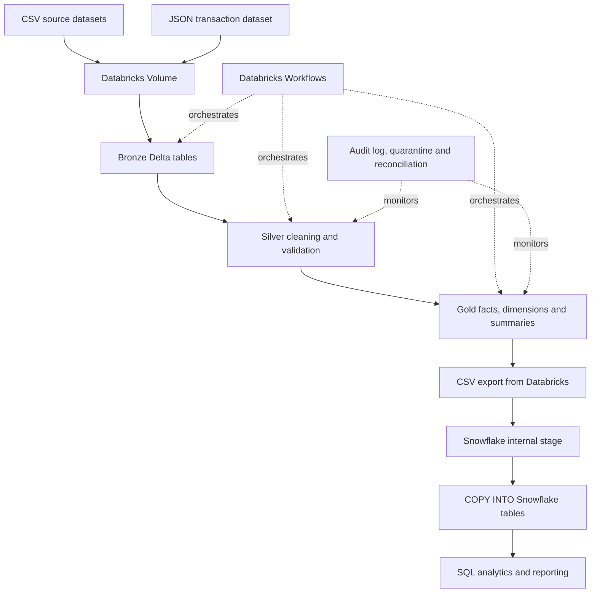

# FinFlow — End-to-End Financial Data Engineering & Analytics

FinFlow is an educational end-to-end Data Engineering capstone that processes financial-services datasets with PySpark and Databricks, applies a Bronze/Silver/Gold Medallion Architecture, and publishes curated Gold datasets to Snowflake for SQL analytics.

## Project architecture



**Storage implementation note:** Azure Data Lake Storage Gen2 was configured as a landing-zone resource, but the Databricks Free Edition pipeline in this repository reads source files from Databricks Volumes. It does not implement a direct ADLS-to-Databricks connection.

## Technology stack

- Python and PySpark
- Apache Spark and Spark SQL
- Databricks Free Edition
- Delta Lake
- Medallion Architecture (Bronze, Silver and Gold)
- Snowflake
- SQL
- Databricks Workflows
- Azure Data Lake Storage Gen2 (configured as a landing-zone resource; not directly connected to this pipeline)
- Git and GitHub

## Data sources

The project uses CSV and JSON files for customers, accounts, branches, loans, transactions and exchange rates. The exchange-rate dataset is a prepared/mock dataset; live API ingestion is not part of this implementation. A database source is also not integrated into the active pipeline.

## Repository layout

```text
.
├── README.md
├── .gitignore
├── notebooks/
│   ├── 00_setup_finflow.py
│   ├── 01_bronze_ingestion.py
│   ├── 02_silver_transformation.py
│   ├── 03_gold_transformation.py
│   ├── 05_Data_Quality_Audit.py
│   ├── 06_Incremental_Ingestion.py
│   ├── 07_Snowflake_Export.py
│   └── 08_Idempotency_Validation.py
├── sql/
│   └── 04_Gold_SQL_Analytics.sql
├── architecture/
│   └── architecture_design.md
├── documentation/
│   ├── implementation_notes.md
│   └── validation_results.md
└── screenshots/
    └── (add selected, sanitized screenshots)
```

## Pipeline implementation

### Bronze
- Reads raw CSV and JSON files from a Databricks Volume.
- Writes raw datasets into Delta tables under `workspace.finflow_bronze`.
- Adds ingestion metadata and batch identifiers.

### Silver
- Standardizes and cleans source attributes.
- Removes duplicate business keys where applicable.
- Applies data-quality and business-rule checks.
- Checks customer/account references for transactions.
- Separates rejected transaction and loan records into quarantine tables.

### Gold
- Builds fact and dimension tables for analytics.
- Creates daily transaction, customer, branch and loan portfolio summaries.
- The customer dimension contains an initial snapshot with effective-date fields; the current implementation should not be described as a fully historized SCD Type 2 solution.

### Incremental processing
The incremental notebook discovers JSON files in the incoming Volume directory, records file-ingestion state, appends new Bronze records, avoids reprocessing records already represented in Silver or quarantine, updates Gold facts and affected summaries, and writes an audit record.

The notebook itself documents that this is an educational single-job workflow, not a fully transactional multi-table production framework.

### Snowflake loading
Nine curated Gold tables were exported from Databricks as CSV files, uploaded to a Snowflake internal stage, and loaded with `COPY INTO`. This is a staged file-based transfer, not a direct Databricks–Snowflake connector integration.

### Orchestration
A Databricks Workflow named `FinFlow_Incremental_Pipeline` was configured with a daily schedule at 01:00 Asia/Calcutta (UTC+05:30). The schedule triggers the incremental notebook; it does not itself deliver new source files to the incoming directory.

## Validation evidence

The tested project state reported:

| Dataset/table | Rows |
|---|---:|
| Bronze transactions | 120,120 |
| Silver transactions | 108,710 |
| Quarantined transactions | 11,410 |
| Gold fact transactions | 108,710 |
| Daily transaction summary | 277 |
| Customer analytics | 10,000 |
| Branch performance | 50 |

The Gold fact validation reported 108,710 rows, 108,710 distinct transaction IDs and zero duplicate IDs. Two incremental job audit records each reported 100 source records, 100 valid records, zero rejected records, `PASSED` reconciliation and `SUCCESS` pipeline status.

These are results from the tested workspace state, not guaranteed results from a fresh deployment. Screenshots can be added to `screenshots/` after removing account identifiers, emails, secrets and other sensitive information.

## Running the notebooks

1. Create or select a Databricks workspace with Unity Catalog Volumes and Delta Lake support.
2. Create the catalog/schema and Volume locations expected by the notebooks, or update the paths and table names to match your environment.
3. Place the dataset archive at `/Volumes/workspace/default/finflow_raw/FinFlow_datasets.zip` if using `00_setup_finflow.py`; the archive is not included in this repository bundle.
4. Run notebooks in this order:
   - `00_setup_finflow.py` (initial dataset extraction/inspection)
   - `01_bronze_ingestion.py`
   - `02_silver_transformation.py`
   - `03_gold_transformation.py`
   - `04_Gold_SQL_Analytics.sql`
   - `05_Data_Quality_Audit.py`
   - `06_Incremental_Ingestion.py` (after placing a new JSON file in the incoming directory)
   - `07_Snowflake_Export.py`
   - `08_Idempotency_Validation.py`
5. Configure the Databricks Workflow to run `06_Incremental_Ingestion.py` after verifying the task path and compute settings.
6. Follow the Snowflake stage and `COPY INTO` steps performed in your Snowflake account; account-specific SQL and credentials are intentionally not stored in this repository.

**Important:** The notebooks contain environment-specific Unity Catalog names and Volume paths. Review and adapt these before running in another workspace. The source files are Databricks notebook-source exports and may contain Databricks-specific `# MAGIC` / `# COMMAND` markers.

## Limitations and future enhancements

- Direct ADLS Gen2 connectivity is not implemented in the active Databricks pipeline.
- Live API ingestion is not implemented.
- A relational database source is not integrated into the active pipeline.
- Snowflake transfer uses manual CSV export, stage upload and `COPY INTO`.
- Production-grade multi-table transactions, comprehensive automated tests, CI/CD and advanced monitoring are outside this educational implementation.

## Learning outcomes

This project demonstrates hands-on practice with PySpark transformations, Delta Lake, Medallion Architecture, incremental file ingestion, data-quality validation, quarantine handling, reconciliation, dimensional modelling, Snowflake loading, SQL analytics and Databricks Workflow scheduling.
