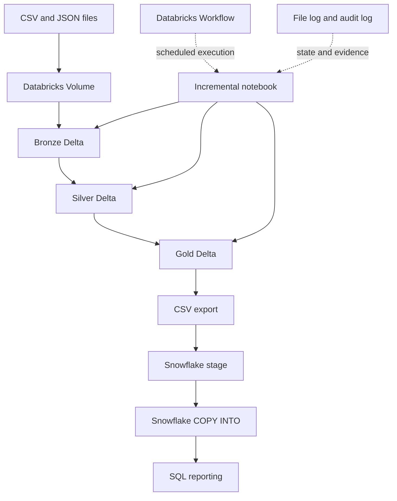

# FinFlow architecture and design notes

## Logical flow

## Layer responsibilities

- **Bronze:** preserve source-oriented records and attach ingestion metadata.
- **Silver:** standardize, deduplicate, validate business rules and quarantine rejected transaction/loan records.
- **Gold:** expose fact/dimension tables and business-oriented summary tables.

## Key design decisions

1. **Databricks Volumes are the active source location.** ADLS Gen2 exists as a configured landing resource but the Free Edition pipeline uses Volume paths.
2. **File-based incremental ingestion:** incoming JSON files are discovered from a Volume directory. A Delta file log records ingestion state. Recovery logic checks existing Bronze records if a file-log write was missed.
3. **Record-level accounting:** the incremental notebook identifies source records not already represented in Silver or transaction quarantine.
4. **Gold refresh:** newly processed transactions are joined to Gold facts, and affected daily/customer/branch summaries are merged.
5. **Snowflake loading:** Gold tables are exported to CSV, staged manually in Snowflake, and loaded with `COPY INTO`.
6. **Orchestration:** a Databricks Workflow schedules the incremental notebook daily at 01:00 Asia/Calcutta.

## Important implementation boundaries

- The workflow is an educational single-job implementation; it is not a fully atomic multi-table production pipeline.
- The customer dimension has an initial snapshot and effective-date columns; it does not implement full SCD Type 2 change history.
- The exchange-rate input is a prepared/mock dataset, not a live API feed.
- There is no active direct connection from Databricks to ADLS Gen2 or a direct Databricks–Snowflake connector.
